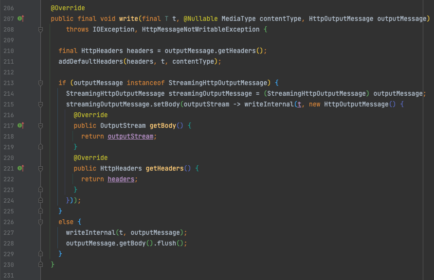
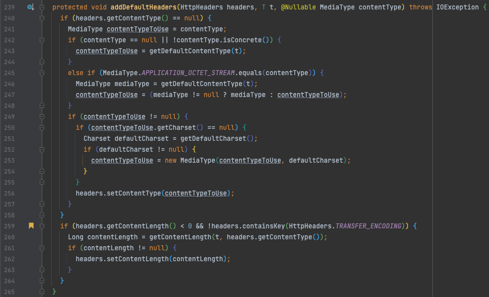

# Spring MVC Download

## 1. Intro
스프링에서 파일 다운로드 처리 대하여 알아보겠습니다.

## 2. 개발환경
- spring boot 2.6.2
- Java 11
- Gradle 7.3.2
- Intellij IDEA 2021.2.4 ️

## 3. 파일 다운로드

### ResponseEntity Resource 이용
```java
@Controller
public class DownloadController {

  private static final String SAMPLE_FILE_NAME = "스프링.png"; // (1)

  @Value("classpath:static/spring.png") // (2)
  private Resource resource;

  @GetMapping("/download/img")
  public ResponseEntity<Resource> downloadImg() {
    return ResponseEntity.ok()
        .contentType(MediaType.IMAGE_PNG) // (3)
        .header(HttpHeaders.CONTENT_DISPOSITION, ContentDisposition.inline() // (4)
            .filename(SAMPLE_FILE_NAME, StandardCharsets.UTF_8)
            .build()
            .toString())
        .body(resource);
  }

  @GetMapping("/download/file")
  public ResponseEntity<Resource> downloadFile() {
    return ResponseEntity.ok()
        .contentType(MediaType.APPLICATION_OCTET_STREAM) // (5)
        .header(HttpHeaders.CONTENT_DISPOSITION, ContentDisposition.attachment() // (6)
            .filename(SAMPLE_FILE_NAME, StandardCharsets.UTF_8)
            .build()
            .toString())
        .body(resource);
  }
}
```
#### 공통
- (1) 한글명 다운로드 처리도 함께 테스트하기 위해 선언해두었습니다.  
- (2) classpath static 폴더에 위치한 png 파일을 Resource 객체로 주입 받습니다.

#### 브라우저에서 바로 렌더링 되는 api (/download/img)
- (3) 렌더링 처리될 Content-Type 헤더를 지정합니다.  
- (4) 브라우저에서 바로 보일 수 있도록 Content-Disposition 헤더를 inline 으로 지정합니다.

#### 파일 다운로드 api (/download/file)
- (5) 브라우저에서 다운로드 기능을 수행하도록 application/octet-stream 로 지정합니다.  
- (6) 파일 다운로드 창이 뜨도록 Content-Disposition 헤더를 attachment 로 지정합니다.

### 테스트 코드
```java
@WebMvcTest(DownloadController.class)
@Slf4j
class DownloadControllerTest {

  @Autowired
  private MockMvc mockMvc;

  @Test
  void downloadImg() throws Exception {
    // when
    MvcResult mvcResult = mockMvc.perform(get("/download/img"))
        .andExpect(status().isOk())
        .andReturn();

    // then
    MockHttpServletResponse response = mvcResult.getResponse();

    int contentLength = response.getContentLength();
    String contentType = response.getContentType();
    String contentDisposition = response.getHeader(HttpHeaders.CONTENT_DISPOSITION);

    assertAll(
        () -> assertThat(contentLength).isEqualTo(9183),
        () -> assertThat(contentType).isEqualTo(MediaType.IMAGE_PNG_VALUE),
        () -> assertThat(contentDisposition).contains("inline", "UTF-8")
    );

    // inline; filename*=UTF-8''%EC%8A%A4%ED%94%84%EB%A7%81.png
    log.info("contentDisposition : {}", contentDisposition);
  }

  @Test
  void downloadFile() throws Exception {
    // when
    MvcResult mvcResult = mockMvc.perform(get("/download/file"))
        .andExpect(status().isOk())
        .andReturn();

    // then
    MockHttpServletResponse response = mvcResult.getResponse();

    int contentLength = response.getContentLength();
    String contentType = response.getContentType();
    String contentDisposition = response.getHeader(HttpHeaders.CONTENT_DISPOSITION);

    assertAll(
        () -> assertThat(contentLength).isEqualTo(9183),
        () -> assertThat(contentType).isEqualTo(MediaType.APPLICATION_OCTET_STREAM_VALUE),
        () -> assertThat(contentDisposition).contains("attachment", "UTF-8")
    );

    // attachment; filename*=UTF-8''%EC%8A%A4%ED%94%84%EB%A7%81.png
    log.info("contentDisposition : {}", contentDisposition);
  }
}
```

### Content-Length Header
컨트롤러에서 ResponseEntity 를 리턴 할 경우 `HttpEntityMethodProcessor` handleReturnValue 에서 처리하며
`AbstractMessageConverterMethodProcessor` writeWithMessageConverters 에서 메세지 컨버터를 선택하여 처리합니다.

이때 선택되는 메세지 컨버터는 `ResourceHttpMessageConverter` 이며,  
부모 클래스 `AbstractHttpMessageConverter` 의 실제 write 하는 메서드에서 211 Line addDefaultHeaders 를 확인해보면


259 Line 에서 실제 Content-Length 가 세팅되어 있지 않을 경우 자동으로 추가해줍니다.  
따라서 컨트롤러에서 따로 해당 헤더를 세팅해주지 않아도 됩니다.


### 파일 다운로드시 한글 파일명 깨짐

#### 기존 브라우저별 한글 깨짐 처리
기존 여러 샘플을 보면 브라우저에서 파일 다운로드시에 한글 깨지는것을 방지 하기위해 하단과 같이  
User-Agent 로 분기 처리하여 브라우저별 filename Encoding 하는것을 자주 볼 수 있습니다.
```java
public String getBrowser(HttpServletRequest request) {
  String userAgent = request.getHeader("User-Agent");
  
  if (userAgent.contains("MSIE") || userAgent.contains("Trident") || userAgent.contains("Edge")) {
    return "MSIE";
  } else if (userAgent.contains("Chrome")) {
    return "Chrome";
  } else if (userAgent.contains("Opera")) {
    return "Opera";
  } else if (userAgent.contains("Safari")) {
    return "Safari";
  } else if (userAgent.contains("Firefox")) {
    return "Firefox";
  } else {
    return "";
  }
}

public String encodeFileName(String browser, String filename) {
  if ("MSIE".equals(browser)) {
    return URLEncoder.encode(filename, StandardCharsets.UTF_8).replaceAll("\\+", "%20");
  }
  if ("Firefox".equals(browser)) {
    return // ...
  }
  if ("Chrome".equals(browser)) {
    return // ...
  }
  ...
}
```

#### RFC6266, RFC5987 이용
상단의 방법 보단 [RFC6266](https://datatracker.ietf.org/doc/html/rfc6266) 과 [RFC5987](https://datatracker.ietf.org/doc/html/rfc5987) 스펙을 다양한 브라우저에서 지원함에   
따라 해당 명세를 이용하여 Content-Disposition 을 설정 할 경우 한번에 처리 가능 합니다.

[http://test.greenbytes.de/tech/tc2231](http://test.greenbytes.de/tech/tc2231/#attwithfn2231utf8) 에서 확인 가능하며
IE 의 경우 IE9 부터 지원 가능합니다.

|Test|Results|
|----|-------|
|FF22 |	pass |
|MSIE8 | unsupported |
|MSIE9 | pass |
|Opera | pass |
|Saf6 |	pass |
|Konq |	pass |
|Chr25 | pass |

#### Spring ContentDisposition Class
해당 처리를 하기 위해 `Spring`에서 손쉽게 사용 할 수 있는 클래스도 지원 합니다.  
`ContentDisposition` 에 filename 에 charset 을 지정 할 경우 자동으로 해당 스펙으로 헤더를 인코딩 합니다.
```java
@Slf4j
class ContentDispositionTest {

  @ParameterizedTest
  @CsvSource({
      "스프링.png, inline; filename*=UTF-8''%EC%8A%A4%ED%94%84%EB%A7%81.png",
      "스프링1234.png, inline; filename*=UTF-8''%EC%8A%A4%ED%94%84%EB%A7%811234.png",
      "스프링-!@#$%.png, inline; filename*=UTF-8''%EC%8A%A4%ED%94%84%EB%A7%81-!%40#$%25.png"
  })
  void buildContentDisposition(String filename, String expected) {
    // when
    ContentDisposition contentDisposition = ContentDisposition.inline()
        .filename(filename, StandardCharsets.UTF_8)
        .build();

    // then
    assertThat(contentDisposition.toString()).isEqualTo(expected);
  }
}
```

#### Content-Disposition 헤더 분석
`Content-Disposition: inline; filename*=UTF-8''%EC%8A%A4%ED%94%84%EB%A7%81.png`  

[RFC2231](https://datatracker.ietf.org/doc/html/rfc2231) 의 4. Parameter Value Character Set and Language Information 참조

파라미터 값에 문자셋이나 언어를 지정해야 할 경우 아스터리스크(*)를 붙이고 `'` 를 구분자로 하여  
문자셋, 언어, 값 순으로 설정하면 됩니다.  

- ex 1) title*=us-ascii'en-us'value
- ex 2) filename*=UTF-8''value

그리고 값은 URL-encoded 로 인코딩합니다.   
마지막으로 문자셋이나 언어는 비워 둘 수있지만 반드시 `'` 를 표시해야 합니다.  

## 4. 마무리
블로그에 사용된  코드는 [Github](https://github.com/csh0034/blog-code/tree/master/spring-download) 에서 확인 하실 수 있습니다.

## 5. 참조
- [MDN, Content-Disposition](https://developer.mozilla.org/ko/docs/Web/HTTP/Headers/Content-Disposition)
- [파일 다운로드 파일명 깨짐 문제](https://www.manty.co.kr/bbs/detail/develop?id=12)