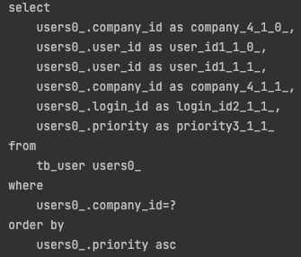

# Spring Jpa, HashSet + @OrderBy

## 1. Intro

@OneToMany 연관관계 설정시에 HashSet 과 @OrderBy 를 사용할 경우 내부동작에 대해 알아보겠습니다.

## 2. 개발환경

- Spring Boot 2.6.5
- Java 11
- Kotlin 1.6.10
- Gradle 7.4.1
- Intellij IDEA 2021.3.3

### build.gradle.kts

```kotlin
import org.jetbrains.kotlin.gradle.tasks.KotlinCompile

plugins {
    val springBootVersion = "2.6.5"
    val dependencyManagementVersion = "1.0.11.RELEASE"
    val kotlinVersion = "1.6.10"

    id("org.springframework.boot") version springBootVersion
    id("io.spring.dependency-management") version dependencyManagementVersion
    kotlin("jvm") version kotlinVersion
    kotlin("kapt") version kotlinVersion
    kotlin("plugin.spring") version kotlinVersion
    kotlin("plugin.jpa") version kotlinVersion
}

group = "com.ask"
version = "0.0.1-SNAPSHOT"
java.sourceCompatibility = JavaVersion.VERSION_11

repositories {
    mavenCentral()
}

dependencies {
    implementation("org.springframework.boot:spring-boot-starter-web")
    implementation("org.springframework.boot:spring-boot-starter-data-jpa")
    implementation("com.fasterxml.jackson.module:jackson-module-kotlin")
    implementation("org.jetbrains.kotlin:kotlin-reflect")
    implementation("org.jetbrains.kotlin:kotlin-stdlib-jdk8")
    runtimeOnly("com.h2database:h2")
    developmentOnly("org.springframework.boot:spring-boot-devtools")
    kapt("org.springframework.boot:spring-boot-configuration-processor")
    testImplementation("org.springframework.boot:spring-boot-starter-test")
}

tasks.withType<KotlinCompile> {
    kotlinOptions {
        freeCompilerArgs = listOf("-Xjsr305=strict")
        jvmTarget = "11"
    }
}

tasks.withType<Test> {
    useJUnitPlatform()
}

allOpen { // (1)
    annotation("javax.persistence.Entity")
}
```

(1) Hibernate 는 Lazy Loading 을 위해 Entity 를 상속받아 프록시 객체를 생성하므로 Entity 에 대하여 allOpen 을 설정합니다.

> plugin.spring 은 plugin.allOpen 을 wrapping 하였기 때문에 allOpen 을 추가로 지정할 수 있습니다.

## 3. Property, Entity 설정

### application.yml

```yaml
spring:
  sql:
    init:
      data-locations: classpath:sql/data.sql # (1)

  datasource:
    url: jdbc:h2:mem:test;DB_CLOSE_ON_EXIT=FALSE
    username: sa
    password:

  jpa:
    properties:
      hibernate:
        show_sql: false
        format_sql: true
    open-in-view: false
    defer-datasource-initialization: true # (2)

logging:
  level:
    "[org.hibernate.SQL]": debug
    "[org.hibernate.type.descriptor.sql.BasicBinder]": trace
```

- (1) 서버 시작시에 실행할 data sql 파일 위치를 지정합니다.
- (2) hibernate 에 의해 schema 생성이 끝난후에 data.sql 파일을 실행하도록 설정합니다.

### resources/sql/data.sql

```sql
insert into tb_company values('company01', 'cname');

insert into tb_user values ('user21', 'user21', 3, 'company01');
insert into tb_user values ('user22', 'user22', 2, 'company01');
insert into tb_user values ('user23', 'user23', 1, 'company01');
```

### Company Entity

```kotlin
@Entity
@Table(name = "tb_company")
class Company(

    @Id
    @GeneratedValue(generator = "uuid")
    @GenericGenerator(name = "uuid", strategy = "uuid2")
    @Column(name = "company_id")
    var id: String? = null,

    @Column(nullable = false, length = 30)
    var name: String,

    @OneToMany(fetch = FetchType.LAZY, mappedBy = "company")
    val users: Set<User> = hashSetOf()

) {
    
    override fun equals(other: Any?): Boolean {
        if (this === other) return true
        if (other == null || Hibernate.getClass(this) != Hibernate.getClass(other)) return false
        other as Company

        return id == other.id
    }

    override fun hashCode(): Int {
        return id.hashCode()
    }

    override fun toString(): String {
        return "Company(id=$id, name='$name')"
    }

}
```

### User Entity

```kotlin
@Entity
@Table(name = "tb_user")
class User(

    @Id
    @GeneratedValue(generator = "uuid")
    @GenericGenerator(name = "uuid", strategy = "uuid2")
    @Column(name = "user_id")
    var id: String? = null,

    @Column(nullable = false, length = 30)
    var loginId: String,

    @Column(nullable = false)
    var priority: Long,

    @ManyToOne(fetch = FetchType.LAZY, optional = false)
    @JoinColumn(name = "company_id")
    var company: Company

) {
    
    override fun equals(other: Any?): Boolean {
        if (this === other) return true
        if (other == null || Hibernate.getClass(this) != Hibernate.getClass(other)) return false
        other as User

        return id == other.id
    }

    override fun hashCode(): Int {
        return id.hashCode()
    }

    override fun toString(): String {
        return "User(id='$id', loginId='$loginId', priority='$priority')"
    }

}
```

## 4. Test Code

### 테스트 1

```kotlin
@DataJpaTest
internal class CompanyTest(
    @Autowired private val testEntityManager: TestEntityManager
) {

    @DisplayName("HashSet 으로 선언한 컬렉션 타입 검증")
    @Test
    internal fun verifyType() {
        // given
        val companyId = "company01" // (1)

        // when
        val company = testEntityManager.find(Company::class.java, companyId)
        val users = company.users

        // then
        assertThat(users).isInstanceOf(PersistentSet::class.java) // (2)
    }

}
```

- (1) data.sql 파일을 통해 insert 되어있는 company 의 id 를 사용합니다.
- (2) hibernate 에 의해 Set 컬렉션은 `PersistentSet` 으로 wrapping 되는것을 검증합니다.

### 테스트 1, 실행 결과 - 성공

- 테스트가 정상 동작하는것을 확인 가능합니다.


### 테스트 2 

```kotlin
@DataJpaTest
internal class CompanyTest(
    @Autowired private val testEntityManager: TestEntityManager
) {

    @DisplayName("HashSet 사용시 순서 검증")
    @Test
    internal fun verifySetOrder() {
        // given
        val companyId = "company01"

        // when
        val company = testEntityManager.find(Company::class.java, companyId)
        val users = company.users

        // then
        assertAll(
            { assertThat(users).isInstanceOf(PersistentSet::class.java) },
            { assertThat(users).flatMap(User::priority).containsSequence(1L, 2L, 3L) }
        )
    }

}
```

### 테스트 2, 실행 결과 - 실패

- priority 필드값의 순서가 일치하지 않아 테스트가 실패합니다.


### 테스트 3

- 테스트에 앞서 Company Entity `@OneToMany` 선언 부분에 `@OrderBy("priority ASC")` 를 추가합니다.

```kotlin
@OneToMany(fetch = FetchType.LAZY, mappedBy = "company")
@javax.persistence.OrderBy("priority ASC")
val users: Set<User> = hashSetOf()
```

- @OrderBy 어노테이션 추가후에 `테스트 2` 에 실행한 테스트를 다시 실행시 성공하는것이 확인 가능합니다.
- 추가로 Lazy Loading 된 컬렉션을 touch 할때 발생하는 sql 에 `order by` 가 추가된 부분도 확인 가능합니다.




## 5. Debugging

`HashSet` 은 순서를 보장하지 않는데 어떻게 Hibernate 에서는 순서를 유지 시킬수 있을까요?

결론 먼저 정리하면 `PersistentSet` 은 Set 을 wrapping 하였기 때문에 내부에 Set 을 생성하여 가지고있는데  
이때 객체 생성에 사용하는것이 `org.hibernate.type.CollectionType` 이며 `@OrderBy` 사용했는지 안했는지에 따라 달라집니다.

따라서 위의 `테스트 1` 과 같이 생각해보면 필드 초기화 타입이 어떤 타입인지는 영향을 끼치지 않으며 선언 타입이 `Set` 일 경우   
`PersistentSet` 으로 wrapping 되며 `@OrderBy` 를 사용하면 내부에 `LinkedHashSet` 을 사용하기 때문에 순서가 보장되는것을 알 수 있습니다.

### Set 에 @OrderBy 를 사용했을 경우

`org.hibernate.type.OrderedSetType` 사용

```java
public class SetType extends CollectionType {
  // ...
  @Override
  public Object instantiate(int anticipatedSize) {
    return anticipatedSize > 0
        ? new LinkedHashSet( anticipatedSize )
        : new LinkedHashSet();
  }
  
}
```

### Set 에 @OrderBy 를 사용하지 않았을 경우

`org.hibernate.type.SetType` 사용

```java
public class SetType extends CollectionType {
  // ...
  @Override
  public Object instantiate(int anticipatedSize) {
    return anticipatedSize <= 0
        ? new HashSet()
        : new HashSet(anticipatedSize + (int) (anticipatedSize * .75f), .75f);
  }
  
}
```

### CollectionType Setting

`CollectionType` 이 세팅되는 메서드 입니다.

```java
package org.hibernate.type;

public class Set extends Collection {
  // ...
  public CollectionType getDefaultCollectionType() {
    if (isSorted()) {   // (1)
      return getMetadata().getTypeResolver()
          .getTypeFactory()
          .sortedSet(getRole(), getReferencedPropertyName(), getComparator());
    } else if (hasOrder()) {    // (2)
      return getMetadata().getTypeResolver()
          .getTypeFactory()
          .orderedSet(getRole(), getReferencedPropertyName());
    } else {
      return getMetadata().getTypeResolver()
          .getTypeFactory()
          .set(getRole(), getReferencedPropertyName());
    }
  }
  // ...
}
```

- (1) 연관관계 맵핑시 선언 타입에 `SortedSet` 을 사용할 경우 true 를 반환합니다.
- (2) `@OrderBy` 를 사용할 경우 `true` 를 반환합니다.

### CollectionBinder

추가적으로 Hibernate 에서 지원하는 컬렉션 타입에 따른 분기 처리를 하단 메서드에서 확인 가능합니다.  
지원하지 않는 타입으로 선언하여 null 을 리턴할 경우 예외가 발생합니다.

`org.hibernate.cfg.annotations.CollectionBinder`


## 6. 마무리

이로서 연관관계 맵핑시에 `Set` 과 `@OrderBy` 를 사용할 경우 어떻게 순서를 보장하는지 알아 보았습니다.  
Intro 에는 `HashSet 과 @OrderBy 를 사용할 경우 내부동작에 대해 알아보겠습니다.` 라고 했었지만  
확인 결과 초기화 타입은 영향이 없으며 선언 타입과 @OrderBy 어노테이션의 조합으로 동작이 달라지는것을 알 수 있었습니다.

이상으로 이번 포스팅은 마무리 하도록 하겠습니다.

블로그에서 사용된 코드는 [GitHub](https://github.com/csh0034/blog-code/blob/master/spring-jpa/spring-jpa-set/README.md) 에서 확인 하실 수 있습니다.

## 7. 참조

- [Does Hibernate PersistentSet maintain order when using @OrderBy](https://discourse.hibernate.org/t/does-hibernate-persistentset-maintain-order-when-using-orderby/73)
- [Best Practices and Common Pitfalls of Using JPA (Hibernate) with Kotlin](https://www.jpa-buddy.com/blog/best-practices-and-common-pitfalls/)
