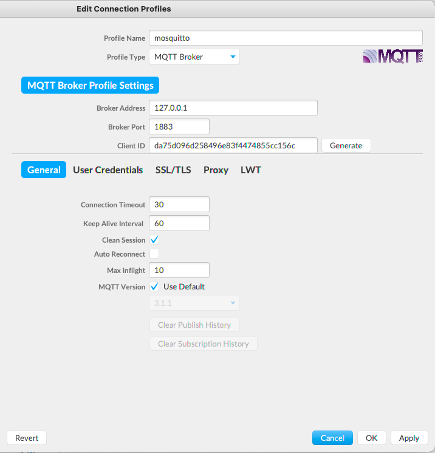
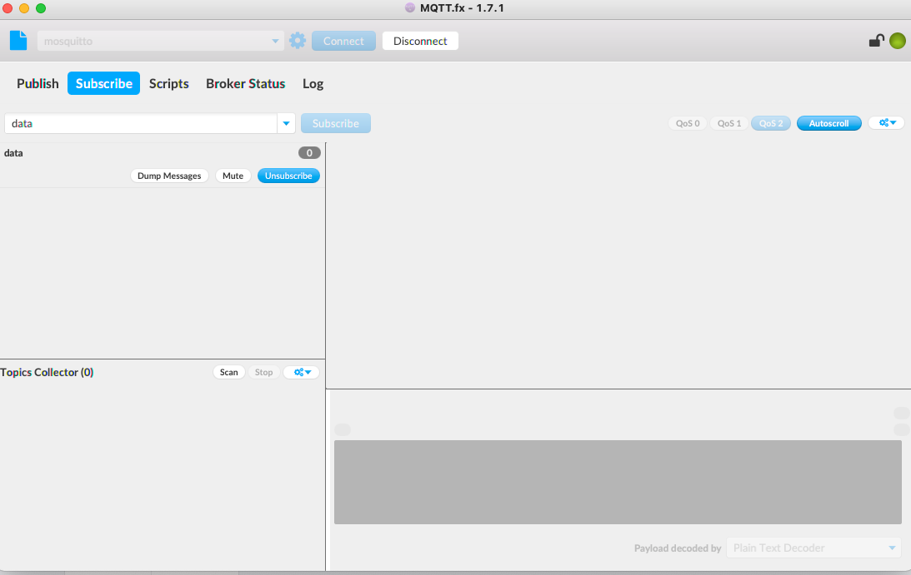
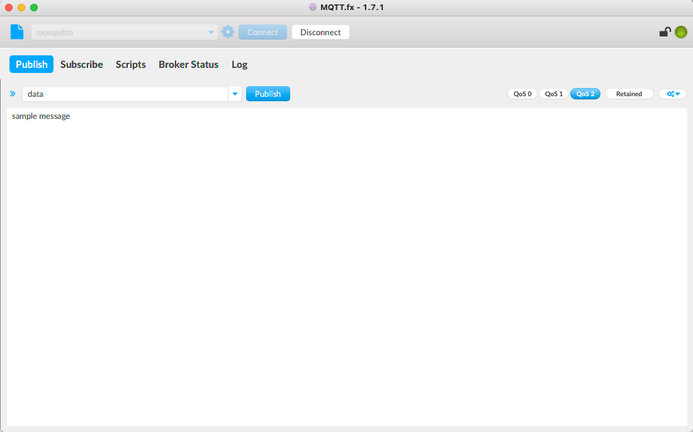
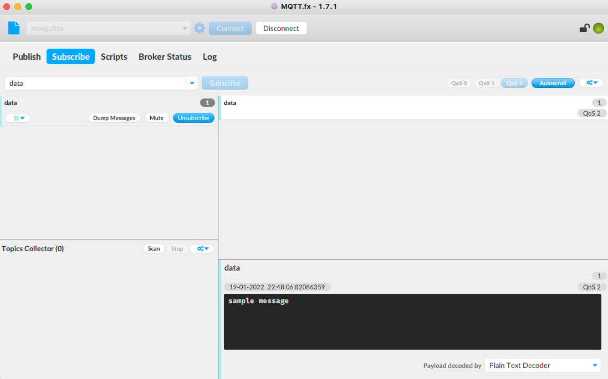
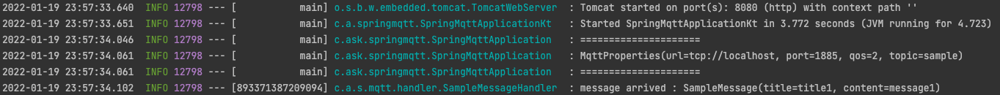
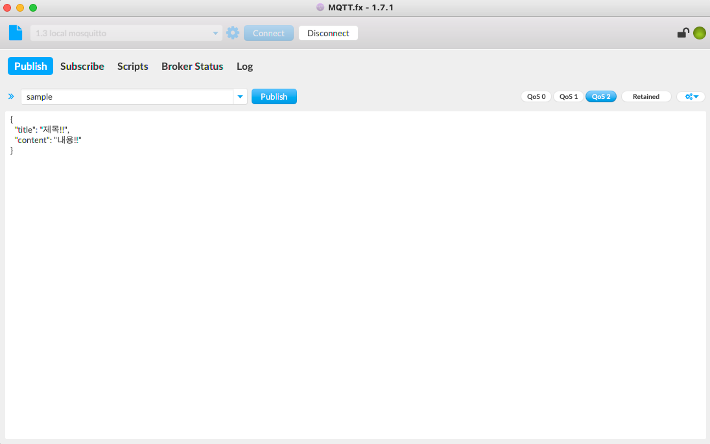
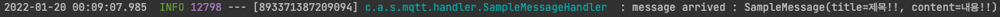

# Spring Integration MQTT

## 1. Intro
Spring Integration 을 이용하여 MQTT Broker 연동에 대하여 알아보겠습니다.   

본 게시글은 Spring 과 MQTT 연동에 관련된 글로서 Kotlin 설정 및 Integration Core 대하여는 깊게 다루지 않습니다.

## 2. MQTT

### MQTT 란?
MQTT(Message Queue for Telemetry Transport)는 M2M 또는 IoT를 위한 경량 프로토콜로서   
저전력 장비에서도 운용 가능하며 network bandwidth가 작은 곳에서도 충분히 운용 가능하도록 설계된 프로토콜입니다.

### MQTT 특징

#### Connection Oriented
MQTT 브로커와 연결을 요청하는 클라이언트는 TCP/IP 소켓 연결을 한 후 명시적으로 연결을 끊거나   
네트워크 사정에 의해 연결이 끊어질 때까지 상태를 유지합니다.

Live 라는 하트비트와 Topic에 발행되는 메시지를 통해 연결을 유지하고 메시지 송수신을 하게 됩니다.

#### Broker
MQTT 프로토콜을 사용하여 Publisher 와 Subscriber 사이에서 메시지를 관리하며 전송해주는 역할을 합니다.

다양한 MQTT Broker
- [Mosquitto](https://mosquitto.org/)
- [Mosca](http://www.mosca.io/)
- [HiveMQ](https://www.hivemq.com/)
- [RabbitMQ, MQTT Plugin](https://www.rabbitmq.com/mqtt.html)
- ...

[MQTT GitHub](https://github.com/mqtt/mqtt.org/wiki/server-support) 에서 다양한 브로커에 대한 기능 지원 목록을 확인 가능합니다.

#### Pub/Sub Model
브로커를 통한 발행/구독 메세징 패턴으로서 발행측은 브로커에게 메세지를 전송하며 브로커는 구독하고있는  
클라이언트에게 메세지를 전송합니다.

따라서 일대일 혹은 일대다 통신이 가능합니다.

#### QoS(Quality of Service)
MQTT 는 3가지의 QoS Level 이 존재합니다.
- 0 : **최대 한번 전송**하며 메시지를 전달 할뿐 구독하는 클라이언트가 받는걸 보장하지 않음
- 1 : **최소 1회 전송**하며 구독하는 클라이언트가 메시지를 받았는지 불확실하면 정해진 횟수만큼 재전송
- 2 : 구독하는 클라이언트가 요구된 메시지를 **정확히 한 번** 수신할 수 있도록 보장

#### Topic
메시지를 발행/구독하는 행위는 채널 단위로 일어납니다.  
이를 MQTT 에서는 토픽이라고 하며 토픽은 슬래시(/)로 구분되는 계층 구조를 갖습니다.

최상위 토픽은 슬래시(/)로 시작되지 않아야 하며 와일드 카드 문자를 사용할 수 있습니다.
- `+` : One-Level Wild Card
- `#` : Multi-Level Wild Card

> a/b/c/d  
> a/b/+/d  
> a/b/#

[HiveMQ, topic best practices](https://www.hivemq.com/blog/mqtt-essentials-part-5-mqtt-topics-best-practices/) 에서 상세하게 설명 하고 있으니 읽어보시는걸 추천 드립니다.

#### LWT (Last will and testament)
MQTT 는 신뢰할 수 없는 네트워크를 포함하는 경우에 자주 사용되기 때문에 비정상적으로 연결이 끊어질 수 있다고 가정하는 것이 합리적입니다.  

LWT 는 유언, 유언장이라는 의미로서 브로커와 클라이언트가 연결이 끊어지면 자동으로 다른 구독자들에게 메세지가 전송되는 기능입니다.

일반적으로 브로커에 연결을 시도하는 시점에 지정되며 will topic, will message, will qos 등을 지정합니다.

## 3. 개발환경
- Spring Boot 2.6.2
- Java 11
- Kotlin 1.6.10
- Gradle 7.3.2
- Intellij IDEA 2021.3.1
- Mosquitto 2.0.14
- MQTT.fx 1.7.1

### Mosquitto docker 설치
다양한 MQTT Broker 중에 Mosquitto 를 사용하여 테스트 해보도록 하겠습니다.

Mosquitto 는 MQTT 3.1과 3.1.1을 구현한 오픈소스 메세지 브로커이며 QOS 2를 지원합니다.  
official image : [docker hub, mosquitto](https://hub.docker.com/_/eclipse-mosquitto)  

docker 를 이용하여 공식 이미지를 실행 할 경우 여러 옵션을 세팅 해주어야 하기 때문에   
in-memory 방식으로 세팅하여 [custom image](https://hub.docker.com/repository/docker/csh0034/mosquitto) 를 docker hub 에 올려 두었습니다.

하단 명령어를 통해 실행 가능합니다.
```shell
$ docker run -d  \
-p 1883:1883 -p 9001:9001 \
--restart always \
--name mosquitto \
csh0034/mosquitto
```

- 1883 : mqtt
- 9001 : websocket mqtt

### MQTT.fx 설치
[MQTT.fx](https://mqttfx.jensd.de/) 는 MQTT 클라이언트 GUI Tool 로서 현재 최신 버전은 유료 이며  
1.7.1 버전은 무료로 사용 가능합니다.

[MQTT.fx 1.7.1 Download Link](https://www.jensd.de/apps/mqttfx/1.7.1/)

#### MQTT Broker 에 연결하기

설치 후 실행 하게되면 톱니바퀴 모양의 설정 버튼 클릭 후 좌측 하단 플러스(등록) 버튼을 클릭합니다.
- Broker Address : Local 에 설치 했으므로 127.0.0.1 설정
- Broker Port : Docker 로 실행시 설정한 포트
- Client ID : Generate 버튼 클릭하여 랜덤 ID 생성

그외 인증 처리는 하지 않으므로 이대로 Apply 버튼 클릭후에 Connect 버튼을 클릭하면 됩니다.

> 메뉴 가장 우측 탭에서 LWT 도 설정 가능합니다.



#### MQTT 메세지 전송 테스트
연결 후에 Pub/Sub 테스트를 해보도록 하겠습니다.  

1. 먼저 Subscribe Tab 으로 이동후에 토픽 입력 및 QoS 2 선택 후 Subscribe 버튼을 클릭합니다.



2. 그 후에 Publish Tab 으로 이동하여 동일한 토픽과 QoS 2 선택 후 Publish 버튼을 클릭합니다.



3. 다시 Subscribe Tab 으로 이동하면 브로커를 통해 전달된 메세지를 확인 할 수 있습니다.




### Gradle, build.gradle.kts
```kotlin
import org.jetbrains.kotlin.gradle.tasks.KotlinCompile

plugins {
    val springBootVersion = "2.6.2"
    val dependencyManagementVersion = "1.0.11.RELEASE"
    val kotlinVersion = "1.6.10"

    id("org.springframework.boot") version springBootVersion
    id("io.spring.dependency-management") version dependencyManagementVersion
    kotlin("jvm") version kotlinVersion
    kotlin("plugin.spring") version kotlinVersion
    kotlin("kapt") version kotlinVersion
}

group = "com.ask"
version = "0.0.1-SNAPSHOT"
java.sourceCompatibility = JavaVersion.VERSION_11

repositories {
    mavenCentral()
}

dependencies {
    implementation("org.springframework.boot:spring-boot-starter-web")
    implementation("org.springframework.boot:spring-boot-starter-integration") // (1)
    implementation("com.fasterxml.jackson.module:jackson-module-kotlin")
    implementation("org.jetbrains.kotlin:kotlin-reflect")
    implementation("org.jetbrains.kotlin:kotlin-stdlib-jdk8")
    implementation("org.springframework.integration:spring-integration-mqtt") // (2)
    implementation("org.springframework.integration:spring-integration-jmx") // (3)
    kapt("org.springframework.boot:spring-boot-configuration-processor")
    testImplementation("org.springframework.boot:spring-boot-starter-test")
    testImplementation("org.springframework.integration:spring-integration-test")
}

tasks.withType<KotlinCompile> {
    kotlinOptions {
        freeCompilerArgs = listOf("-Xjsr305=strict")
        jvmTarget = "11"
    }
}

tasks.withType<Test> {
    useJUnitPlatform()
}
```
(1) Spring Integration Core 및 Spring Boot 의 자동설정을 지원합니다.  
(2) Eclipse Paho MQTT Client 를 기반으로 스프링과 통합을 지원합니다.  
(3) JMX 알림을 수신하고 게시하는 기능을 지원하는 종속성 입니다.
  - 해당 종속성 없이 실행할 경우 예외가 발생하여 실행되지 않습니다. 
  - 관련 사항은 하단 링크에서 확인 가능합니다.
  - [Unable to register MBean - Invalid character `:' in value](https://github.com/spring-projects/spring-integration/issues/3051)

## 4. Spring Boot + MQTT 연동

### application.yml
브로커 연결정보를 하단 MqttProperties 를 통해 사용할 수 있도록 선언합니다.
```yaml
mqtt:
  url: tcp://localhost
  port: 1885 #(1)
  qos: 2
  topic: sample
```

(1) 제 로컬환경에 1883 port 를 사용하고 있어 변경하였습니다. Docker 에서 지정한 포트로 설정하면 됩니다.

### MqttProperties
```kotlin
@ConstructorBinding // (1)
@ConfigurationProperties("mqtt")
data class MqttProperties(
    val url: String,
    val port: Int,
    val qos: Int,
    val topic: String,
) {
    fun connectionInfo() = "$url:$port"
}
```

(1) @ConstructorBinding 을 이용하여 **불변** 상태로 객체를 설정하였습니다.  
- @SpringBootApplication 위치에 @ConfigurationPropertiesScan 도 같이 등록해야 동작 합니다.

### MqttConfig
```kotlin
@Configuration
class MqttConfig(
    private val sampleMessageHandler: SampleMessageHandler,
    private val mqttProperties: MqttProperties,
    private val objectMapper: ObjectMapper,
) {

    companion object {
        const val MQTT_OUTBOUND_CHANNEL = "outboundChannel"
    }

    @Bean
    fun mqttPahoClientFactory(): MqttPahoClientFactory { // (1)
        return DefaultMqttPahoClientFactory()
            .apply {
                connectionOptions = connectOptions()
            }
    }

    private fun connectOptions(): MqttConnectOptions {
        return MqttConnectOptions()
            .apply { // (2)
                serverURIs = arrayOf(mqttProperties.connectionInfo())
            }
    }

    @Bean
    fun mqttInboundFlow() = integrationFlow(mqttChannelAdapter()) { // (3)
        transform(Transformers.fromJson(SampleMessage::class.java)) // (4)
        handle {
            sampleMessageHandler.handle(it.payload as SampleMessage) // (5)
        }
    }

    private fun mqttChannelAdapter(): MqttPahoMessageDrivenChannelAdapter { // (6)
        return MqttPahoMessageDrivenChannelAdapter(
            MqttClient.generateClientId(),
            mqttPahoClientFactory(),
            mqttProperties.topic)
            .apply {
                setCompletionTimeout(5000)
                setConverter(DefaultPahoMessageConverter())
                setQos(mqttProperties.qos)
            }
    }

    @Bean
    fun mqttOutboundFlow() = integrationFlow(MQTT_OUTBOUND_CHANNEL) { // (7)
        transform<Any> { // (8)
            when (it) {
                is SampleMessage -> objectMapper.writeValueAsString(it)
                else -> it
            }
        }
        handle(mqttOutboundMessageHandler()) // (9)
    }

    private fun mqttOutboundMessageHandler(): MessageHandler { // (10)
        return MqttPahoMessageHandler(MqttAsyncClient.generateClientId(), mqttPahoClientFactory())
            .apply {
                setAsync(true)
                setDefaultTopic(mqttProperties.topic)
                setDefaultQos(mqttProperties.qos)
            }
    }

    @MessagingGateway(defaultRequestChannel = MQTT_OUTBOUND_CHANNEL)
    interface MqttOutboundGateway { // (11)

        @Gateway
        fun publish(@Header(MqttHeaders.TOPIC) topic: String, data: String) // (12)

        @Gateway
        fun publish(data: SampleMessage) // (13)
    }
}
```

(1) MQTT 클라이언트 연결을 담당하는 객체를 선언 합니다.

(2) 연결 정보, 인증 정보(username, password), LWT 등을 지정 가능합니다.

(3) Integration MQTT Inbound Flow 를 선언 합니다. (subscribe)

(4) MQTT 메세지가 수신될 경우 Body 의 Json String 을 SampleMessage 클래스로 변환합니다.

(5) Transformer 에 의해 deserialize 된 객체를 핸들링 합니다.   
- 이때 메세지 핸들러의 제네릭 타입은 Star-projections (*) 이므로 타입 캐스팅이 필요합니다.
- 하지만 명확히 타입을 알고 있으므로 unsafe cast operator(as) 를 사용하여 캐스팅 합니다.

(6) MQTT Inbound Channel Adaptor 객체를 선언 합니다.
- Topic, Timeout, clientId, QoS 등을 지정 합니다.
- 지정한 Topic 으로 메세지를 전송할 경우 해당 어댑터에서 처리됩니다.

(7) Integration MQTT Outbound Flow 를 선언 합니다. (publish)
- Integration 내부 outboundChannel 채널에 메세지를 전송 할 경우 해당 Flow 에서 처리합니다.

(8) outboundChannel 로 메세지가 전달 될 경우 타입체크를 하여 변환후 반환합니다.
- MQTT Outbound Handler 는 byte[], String 타입만 처리 가능하므로 객체일 경우 Json String 으로 변환 합니다.

(9) 메세지를 전송할 수 있는 핸들러를 등록합니다.

(10) 전송할 default Topic, default QoS 등을 지정하여 객체를 생성합니다.
- default 세팅이므로 @MessagingGateway 를 통해 메세지를 전송할때 변경 가능합니다.

(11) outboundChannel 로 메세지를 보내주는 역할을 하는 MessagingGateway 를 선언합니다.
- 스프링에서 해당 어노테이션을 스캔하여 프록시 객체를 생성하므로 의존성을 주입 받아 사용가능합니다.
- @IntegrationComponentScan 을 통해 처리되며 Spring Boot 의 경우 자동 등록됩니다.

(12) Topic 과 String 타입의 메세지를 전송 하는 Gateway 를 선언합니다.

(13) default Topic 을 사용하며 SampleMessage 타입의 메세지를 전송 하는 Gateway 를 선언합니다.
- (8) 처리 과정에서 String 타입으로 변환됩니다.

### SampleMessageHandler, SampleMessage
```kotlin
@Component
class SampleMessageHandler { // (1)

    private val log = logger()

    fun handle(message: SampleMessage) {
        log.info("message arrived : $message")
    }
}

data class SampleMessage(val title: String, val content: String) // (2)
```

(1) MQTT 메세지를 처리하는 핸들러를 등록하였습니다.
- 예제 코드에선 로그만 출력하도록 하였으며 실제 개발시엔 DB 저장 등의 처리를 할 수 있습니다.

(2) JSON String 형태로 전달된 메세지를 변환할 클래스를 선언하였습니다.

## 5. MQTT 수신 및 전송
ApplicationRunner 를 선언하여 서버가 실행 될때 메세지를 1회 전송하도록 하였습니다.

```kotlin
@Component
class MessageSendRunner(
    private val mqttOutboundGateway: MqttConfig.MqttOutboundGateway // (1)
) : ApplicationRunner {

    override fun run(args: ApplicationArguments) {
        mqttOutboundGateway.publish(SampleMessage("title1", "message1"))
    }
}
```

(1) @MessagingGateway 로 선언된 인터페이스의 프록시 객체를 주입받습니다.
- IntelliJ 에서 "Could not autowire. No beans of 'MqttOutboundGateway' type found."  
  에러가 표시 되지만 서버를 실행하면 의존성 주입이 정상 동작합니다.

메세지를 전송 할 경우 하단 흐름을 통해 다시 전달된걸 콘솔을 통해 확인 가능합니다.

1. 메세지를 지정된 토픽과 함께 연결된 Broker 로 전송
2. Broker 는 연결되어있는 클라이언트중 매칭되는 토픽으로 메세지를 전달
3. MQTT Inbound Channel Adaptor 
4. Integration MQTT Inbound Flow 
5. Transformer 에 의해 객체로 변경
6. SampleMessageHandler handle 메서드 호출
7. message arrived 로그 출력

Console


MQTT.fx 를 통하여도 메세지를 전송해 보겠습니다.  
SampleMessage 의 프로퍼티에 맞춰 JSON 형태로 전송합니다.



Console


## 6. 마무리
이로서 MQTT 및 Spring Integration 을 통한 MQTT 연동에 대해서 알아 보았습니다.  
Spring Integration MQTT 레퍼런스가 잘 되어있으니 같이 보시는걸 추천 드립니다.

MQTT 를 학습하시는 분들께 도움이 되었기를 바라며 이만 마무리 하겠습니다.

블로그에 사용된  코드는 [Github](https://github.com/csh0034/blog-code/tree/master/spring-mqtt) 에서 확인 하실 수 있습니다.

## 7. 참조
- [Spring Integration, MQTT Support](https://docs.spring.io/spring-integration/docs/current/reference/html/mqtt.html)
- [Introduction-mqtt-qos](https://www.emqx.com/en/blog/introduction-to-mqtt-qos)
- [MQTT 적용을 통한 중계시스템 개선](https://techblog.woowahan.com/2540/)
