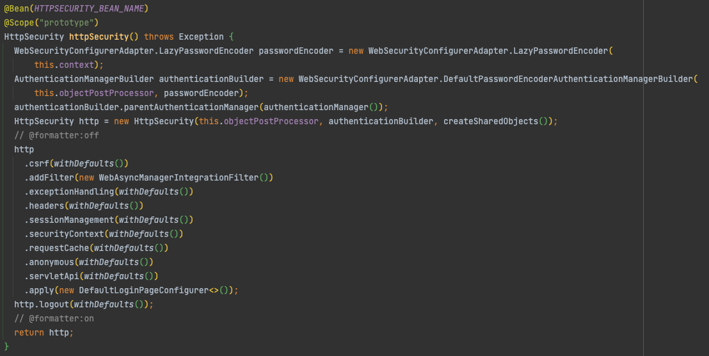

# Spring Security Setting

## 1. Intro

Spring Security 를 사용할땐 각 필터를 커스터마이징 하기위하여 별도의 Security Configuration 설정을 합니다.  
이때 발생하는 몇가지 문제점에 대해 알아보고 리팩토링을 해보도록 하겠습니다.

- WebSecurityConfigurerAdapter 상속 제거
- Lambda DSL 적용
- Resource Filter Chain 설정

## 2. 개발환경

- Spring Boot 2.6.7
- Spring Security 5.6.3
- Java 11
- Gradle 7.4.1
- Intellij IDEA 2022.1

### build.gradle

```groovy
plugins {
    id 'org.springframework.boot' version '2.6.7'
    id 'io.spring.dependency-management' version '1.0.11.RELEASE'
    id 'java'
}

group = 'com.ask'
version = '0.0.1-SNAPSHOT'
sourceCompatibility = '11'

configurations {
    compileOnly {
        extendsFrom annotationProcessor
    }
}

repositories {
    mavenCentral()
}

dependencies {
    implementation 'org.springframework.boot:spring-boot-starter-web'
    implementation 'org.springframework.boot:spring-boot-starter-security'
    compileOnly 'org.projectlombok:lombok'
    annotationProcessor 'org.projectlombok:lombok'
    testImplementation 'org.springframework.boot:spring-boot-starter-test'
    testImplementation 'org.springframework.security:spring-security-test'
}

tasks.named('test') {
    useJUnitPlatform()
}
```

## 3. Setting

### 기존 Java Config

일반적으로 많이 보이는 Java Configuration 입니다.  
이렇게 구성을 할때 몇가지 문제점이 발생하는데 하단에서 알아보도록 하겠습니다.

```java
@EnableWebSecurity  // Spring Security 활성화
@Configuration
public class SecurityConfig extends WebSecurityConfigurerAdapter {

  @Override
  public void configure(WebSecurity web) {
    web.ignoring().antMatchers("/resources/**"); // resource 에 대해 Spring Security FilterChain 제외
  }
  
  @Override
  protected void configure(HttpSecurity http) throws Exception {
    http.csrf().disable()
        .headers()  // 보안 헤더 설정
          .frameOptions().disable().and()
        .authorizeRequests()  // 권한 검증 설정
          .antMatchers("/user/**").hasRole("USER")
          .anyRequest().authenticated().and()
        .formLogin()
          .loginPage("/user/login").permitAll()
          .defaultSuccessUrl("/index").and()
        .logout()
          .logoutUrl("/user/logout");
  }

}
```

#### EnableWebSecurity
 
간혹 `@EnableWebSecurity` 를 추가하는 경우가 있는데 만약 Spring Boot 를 사용하고 있을 경우   
`SecurityAutoConfiguration` 에서 import 되는 `WebSecurityEnablerConfiguration` 에 의해 자동으로  
세팅 되므로 추가하지 않아도 됩니다.

```java
@Configuration(proxyBeanMethods = false)
@ConditionalOnMissingBean(name = BeanIds.SPRING_SECURITY_FILTER_CHAIN)
@ConditionalOnClass(EnableWebSecurity.class)
@ConditionalOnWebApplication(type = ConditionalOnWebApplication.Type.SERVLET)
@EnableWebSecurity
class WebSecurityEnablerConfiguration {

}
```

#### ant pattern 을 이용한 ignore 처리 권장되지 않음

해당 설정으로 실행시 하단과 같은 WARN 로그가 발생합니다.

```text
You are asking Spring Security to ignore Ant [pattern='/resource/**']. This is not recommended -- please use permitAll via HttpSecurity#authorizeHttpRequests instead.
```

이 로그는 Spring Security 5.5.x 에 추가되었으며 [Spring Security GitHub Issue](https://github.com/spring-projects/spring-security/issues/10938) 에서 그 이유에 대해 답변을 확인할 수 있습니다.

간단히 정리해보자면 다음과 같습니다.

> web.ignoring() 은 Spring Security 가 해당 엔드포인트에 보안 헤더 또는 기타 보호 조치를 제공할 수  
없음을 의미한다. 따라서 authorizeHttpRequests permitAll 을 사용 할 경우 권한은 검증하지 않으면서  
요청을 보호 할수 있으므로 권장된다.

추가로 리소스에 대해서 SecurityContext 를 세션에서 찾는것을 방지하여 성능 최적화 방법을 유지하려면  
Resource 용 SecurityFilterChain 을 추가하는 방법을 제시하였습니다.  
이는 문제점 해결 방안 부분에서 알아보도록 하겠습니다.

#### Indent 문제

현재 설정의 경우 Configurer 에 `disable()` 를 호출하지 않을 경우 체이닝을 위해 `and()` 를 호출해야합니다.  
또한 가독성을 위해 들여쓰기를 하고 있지만 명확히 구분되지 않아 작성하는 사람마다 다르게 할 여지가 있습니다.

```java
http.csrf().disable()
    .headers()
      .frameOptions().disable().and() // HeadersConfigurer 의 disable() 이 아니기때문에 and() 호출해야함.
    .authorizeRequests()
      .antMatchers("/user/**").hasRole("USER")  // 가독성을 위해선 들여쓰기를 해야하나 명확하지 않음
      .anyRequest().authenticated().and()
    .formLogin()
    .loginPage("/user/login").permitAll() // 들여쓰기를 안할 경우 가독성이 좋지 않음
      .defaultSuccessUrl("/index").and()
    .logout()
      .logoutUrl("/user/logout");
```

#### 5.7.X 부터 WebSecurityConfigurerAdapter Deprecate

현재 Spring Boot 2.6.7 기준 Spring Security 5.6.3 을 사용하고 있지만 추후 5.7.X 부터  
WebSecurityConfigurerAdapter 가 Deprecate 될 예정입니다.  
[Spring Blog, Spring Security without the WebSecurityConfigurerAdapter](https://spring.io/blog/2022/02/21/spring-security-without-the-websecurityconfigureradapter) 에서 확인 가능합니다.

### 문제점 해결 방안

#### WebSecurityConfigurerAdapter 를 상속받지 않고 적용

`WebSecurityConfigurerAdapter` 를 상속받지 않고 필터체인을 구성하는 방법으론  
`SecurityFilterChain` 를 `Bean` 으로 선언하는 방법이 있습니다.  
이때 `HttpSecurity` 를 주입받아 사용하면 됩니다.

위에서 선언한 Security 설정에 적용하면 하단과 같습니다.

```java
@Configuration
public class SecurityConfig {

  @Bean
  public WebSecurityCustomizer webSecurityCustomizer() {
    return web -> web.ignoring().antMatchers("/resources/**");
  }

  @Bean
  public SecurityFilterChain securityFilterChain(HttpSecurity http) throws Exception {
    return http.csrf().disable()
        .headers()
          .frameOptions().disable().and()
        .authorizeRequests()
          .antMatchers("/user/**").hasRole("USER")
          .anyRequest().authenticated().and()
        .formLogin()
          .loginPage("/user/login").permitAll()
          .defaultSuccessUrl("/index").and()
        .logout()
          .logoutUrl("/user/logout").and()
        .build();
  }

}
```

코드 자체는 크게 변경된것은 없으며 WebSecurityConfigurerAdapter 상속을 제거하고  
`WebSecurityCustomizer` 선언과 HttpSecurity 의 build() 를 호출후 리턴하여 Bean 으로 등록하면 됩니다.

`HttpSecurityConfiguration` 을 확인해보면 `HttpSecurity` 에 기본적인 설정을 한후 `prototype` 으로   
Bean 을 설정하고 있습니다. 따라서 매번 주입 받을때마다 새로운 인스턴스를 주입받을 수 있습니다.



**주의사항**

WebSecurityConfigurerAdapter 상속과 SecurityFilterChain Bean 을 동시에 사용할 경우 하단과 같은  
로그가 발생하며 어플리케이션 시작에 실패하게됩니다.

```text
Caused by: java.lang.IllegalStateException: Found WebSecurityConfigurerAdapter as well as SecurityFilterChain. Please select just one.
	at org.springframework.util.Assert.state(Assert.java:76) ~[spring-core-5.3.19.jar:5.3.19]
	at org.springframework.security.config.annotation.web.configuration.WebSecurityConfiguration.springSecurityFilterChain(WebSecurityConfiguration.java:107) ~[spring-security-config-5.6.3.jar:5.6.3]
	at java.base/jdk.internal.reflect.NativeMethodAccessorImpl.invoke0(Native Method) ~[na:na]
	at java.base/jdk.internal.reflect.NativeMethodAccessorImpl.invoke(NativeMethodAccessorImpl.java:62) ~[na:na]
	at java.base/jdk.internal.reflect.DelegatingMethodAccessorImpl.invoke(DelegatingMethodAccessorImpl.java:43) ~[na:na]
	at java.base/java.lang.reflect.Method.invoke(Method.java:566) ~[na:na]
	at org.springframework.beans.factory.support.SimpleInstantiationStrategy.instantiate(SimpleInstantiationStrategy.java:154) ~[spring-beans-5.3.19.jar:5.3.19]
	... 22 common frames omitted
```

따라서 둘중 한가지만 사용하도록 해야하며 명시적으로 WebSecurityConfigurerAdapter 를 선언하지  
않았으나 로그가 발생한다면 로그 발생지점을 디버깅하여 어디서 등록된것인지 확인 해보시는걸 추천드립니다.

> 제 경험으론 지금은 Deprecate 된 Spring Security OAuth2 Resource Server 와  
  SecurityFilterChain Bean 를 함께 사용시 Resource Server 가 내부에서 WebSecurityConfigurerAdapter 를   
  사용 하고 있어 해당 이슈를 접한적이 있습니다.

#### Resource 용 SecurityFilterChain 적용

먼저 WebSecurityCustomizer 설정을 제거하며 하단과 같이 `@Order(0)` 을 추가하여 먼저 FilterChain 을 타도록 지정합니다.    
resources(css, js 등) 의 경우 securityContext 등에 대한 조회가 불필요 하므로 disable 합니다.

```java
@Bean
@Order(0)
public SecurityFilterChain resources(HttpSecurity http) throws Exception {
  return http.requestMatchers(matchers -> matchers
      .antMatchers("/resources/**"))
    .authorizeHttpRequests(authorize -> authorize
      .anyRequest().permitAll())
    .requestCache(RequestCacheConfigurer::disable)
    .securityContext(AbstractHttpConfigurer::disable)
    .sessionManagement(AbstractHttpConfigurer::disable)
    .build();
}
```

여기서 `authorizeHttpRequests` 은 기존에 사용하는 `authorizeRequests` 와 다른 설정입니다.  
이번 게시글에선 5.6.1 버전부터 authorizeHttpRequests(AuthorizationFilter) 가 authorizeRequests(FilterSecurityInterceptor) 를   
대체한다 정도로만 정리하겠습니다.

#### Lambda DSL 적용하여 Indent 문제 해결

Spring Security 5.2.X 부터 Lambda DSL 이 추가되었습니다.   
이는 보안 필터 설정을 담당하는 Configurer 에 대해 Lambda 형식으로 작성할 수 있도록 지원합니다.

위에서 선언한 Security 설정의 각 Configurer 에 대해 적용하면 하단과 같습니다.

```java
@Bean
public SecurityFilterChain securityFilterChain(HttpSecurity http) throws Exception {
  return http.csrf(AbstractHttpConfigurer::disable)
      .headers(headers -> headers
          .frameOptions(HeadersConfigurer.FrameOptionsConfig::disable))
      .authorizeRequests(authorize -> authorize
          .antMatchers("/user").hasRole("USER")
          .anyRequest().authenticated())
      .formLogin(form -> form
          .loginPage("/user/login").permitAll()
          .defaultSuccessUrl("/index"))
      .logout(logout -> logout
          .logoutUrl("/user/logout"))
      .build();
}
```

Disable 설정에 대해서 Method Reference 적용 하였으며 Lambda DSL 을 통해  
명확한 Indent 구분이 되는것이 장점입니다.

추가로 각 Configurer 에서 모든 설정을 진행한 후에 `HttpSecurity` 를 반환하므로   
체이닝을 위해 명시적으로 `and()` 를 호출하지 않아도 됩니다.

### 리팩토링된 Java Config

```java
@Configuration
public class SecurityConfig {

  @Bean
  @Order(0)
  public SecurityFilterChain resources(HttpSecurity http) throws Exception {
    return http.requestMatchers(matchers -> matchers
            .antMatchers("/resources/**"))
        .authorizeHttpRequests(authorize -> authorize
            .anyRequest().permitAll())
        .requestCache(RequestCacheConfigurer::disable)
        .securityContext(AbstractHttpConfigurer::disable)
        .sessionManagement(AbstractHttpConfigurer::disable)
        .build();
  }

  @Bean
  public SecurityFilterChain securityFilterChain(HttpSecurity http) throws Exception {
    return http.csrf(AbstractHttpConfigurer::disable)
        .headers(headers -> headers
            .frameOptions(HeadersConfigurer.FrameOptionsConfig::disable))
        .authorizeRequests(authorize -> authorize
            .antMatchers("/user").hasRole("USER")
            .anyRequest().authenticated())
        .formLogin(form -> form
            .loginPage("/user/login").permitAll()
            .defaultSuccessUrl("/index"))
        .logout(logout -> logout
            .logoutUrl("/user/logout"))
        .build();
  }

}
```

## 4. 마무리

이로서 Spring Security 에서 권장하는 방법으로 기존 설정들에 대해 리팩토링을 진행 해보았습니다.  
적용한 내용에 대해선 하단 참조 링크와 Spring Security 레퍼런스를 같이 보시면 좋을것 같습니다.  

이상으로 이번 포스팅은 마무리 하도록 하겠습니다.

블로그에 사용된 코드는 [GitHub](https://github.com/csh0034/blog-code/tree/master/spring-security/spring-security-setting) 에서 확인 하실 수 있습니다.

## 5. 참조

- [Spring Blog, spring-security-lambda-dsl](https://spring.io/blog/2019/11/21/spring-security-lambda-dsl)
- [Spring Blog, spring-security-without-the-WebSecurityConfigurerAdapter](https://spring.io/blog/2022/02/21/spring-security-without-the-websecurityconfigureradapter)
- [GitHub Issue, WARN when ignoring antMatchers - please use permitAll](https://github.com/spring-projects/spring-security/issues/10938)
